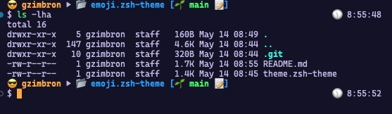

# Emoji Theme for Oh-My-Zsh

This is a custom theme for Oh-My-Zsh that adds emoji icons to your terminal prompt.

## Preview



## Prerequisites

Before installing the emoji theme, make sure you have the following prerequisites:

- [Oh-My-Zsh](https://ohmyz.sh/) installed on your system.

## Installation

To install the emoji theme, follow these steps:

1. Open a terminal window.

2. Clone the repository to your `oh-my-zsh! themes` directory:

```shell
git clone https://github.com/gzimbron/emoji.zsh-theme.git ~/.oh-my-zsh/themes/emoji.zsh-theme
```

3. Set the theme in your `~/.zshrc` file:

```shell
ZSH_THEME="emoji.zsh-theme/theme"
```

4. Save the changes and exit the text editor.

5. Restart your terminal or run the following command to apply the changes:

```shell
source ~/.zshrc
```

## Usage

Once the emoji theme is installed and set as your active theme, you will see emoji icons in your terminal
prompt.

## Customization

If you want to customize the emoji theme, you can modify the `emoji.zsh-theme/theme.zsh-theme` file directly. You can
change the emoji icons or adjust the prompt layout according to your preferences.

## Uninstallation

To uninstall the emoji theme, follow these steps:

1. Open a terminal window.

2. Navigate to the Oh-My-Zsh themes directory:

```shell
cd ~/.oh-my-zsh/themes
```

3. Remove the emoji.zsh-theme folder:

```shell
rm -rf emoji.zsh-theme
```

4. Update your `~/.zshrc` file to use a different theme or revert to the default theme.

5. Save the changes and exit the text editor.

6. Restart your terminal or run the following command to apply the changes:

```shell
source ~/.zshrc
```

That's it! You have successfully installed and configured the emoji theme for Oh-My-Zsh.
